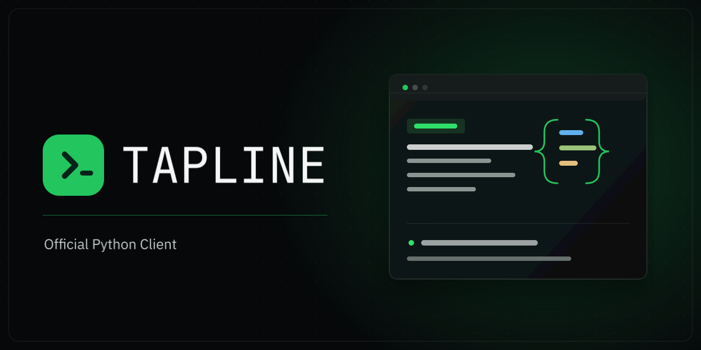

[](https://tapline.sh?utm_source=python_sdk_readme&utm_medium=referral&utm_campaign=developer_acquisition&utm_content=banner)

# tapline

[](https://pypi.org/project/tapline/)
[](https://pypi.org/project/tapline/)

Tapline is a Python YouTube scraper and YouTube transcript extractor for public
data. You can scrape YouTube transcripts, search videos, and collect structured
data for videos, channels, and playlists. Extract YouTube comments and replies
one page at a time. Use the pagination helper to scrape YouTube comments beyond
the first page.

Tapline requires Python 3.10 or newer and an API key. Get your key on the
[Tapline YouTube page](https://tapline.sh/youtube?utm_source=python_sdk_readme&utm_medium=referral&utm_campaign=developer_acquisition&utm_content=get_api_key). Every new account starts with
500 free credits, and you do not need a card.

## Install

```sh
pip install tapline
```

Set your API key as an environment variable:

```sh
export TAPLINE_API_KEY="your-api-key"
```

The examples below read the key from that variable automatically.

You can also pass the key when you create the client:

```python
from tapline import SyncTaplineClient

tapline = SyncTaplineClient(api_key="your-api-key")
```

`SyncTaplineClient` blocks. `TaplineClient` is its awaitable twin, for an async
application:

```python
from tapline import TaplineClient

tapline = TaplineClient(api_key="your-api-key")
```

## Client methods

| Method | What you get |
| --- | --- |
| `search(query=...)` | Search results |
| `metadata(video)` | Title, counts, dates, chapters, thumbnails |
| `subtitles(video)` | A transcript document |
| `subtitle_tracks(video)` | The languages a video has captions in |
| `comments(video)` | One page of comment threads |
| `comment_replies(video, comment_id, cursor=...)` | One page of replies |
| `channel(channel)` | A channel's profile and subscriber count |
| `channel_videos(channel)` | One page of a channel's uploads |
| `playlist(playlist_id)` | A playlist and its videos |
| `heatmap(video)` | Which parts of a video get replayed |
| `formats(video)` | The streams YouTube offers for a video |

Every method is on both the sync and async clients, and takes an optional
`timeout` that overrides the client's own for that one call.

## Get a transcript

Use `SyncTaplineClient` for a regular Python script:

```python
from tapline import SyncTaplineClient

with SyncTaplineClient() as tapline:
    subtitles = tapline.youtube.subtitles(
        "https://www.youtube.com/watch?v=jNQXAC9IVRw",
        subtitle_format="txt",
    )

    print(subtitles.transcript)
```

The default language is English. Tapline accepts BCP 47 language tags such as
`en`, `pt-BR`, `es-419`, and `zh-Hans`:

```python
subtitles = tapline.youtube.subtitles(
    "jNQXAC9IVRw",
    language="pt-BR",
    subtitle_format="txt",
)
```

Tapline can also return `srt`, `vtt`, `ttml`, or `json3` transcripts.

The default `source="any"` prefers a human-authored track and falls back to a
machine-generated one. Pass `source="manual"` or `source="auto"` to insist on
one or the other.

## List subtitle languages

If you do not know which languages a video has, check its subtitle tracks:

```python
from tapline import SyncTaplineClient

with SyncTaplineClient() as tapline:
    tracks = tapline.youtube.subtitle_tracks("jNQXAC9IVRw")

    for track in tracks.manual + tracks.auto:
        print(track.language, track.language_name)
```

Each track's `language` and `formats` feed straight back into `subtitles`.

## Get every transcript from a channel

`pages` walks a channel's uploads for you, so a whole channel is one loop over
another — see [walking pages](#walk-every-page):

```python
from tapline import NotFoundError, SyncTaplineClient

with SyncTaplineClient() as tapline:
    pages = tapline.youtube.pages(
        lambda cursor: tapline.youtube.channel_videos("@Computerphile2", cursor=cursor)
    )

    for page in pages:
        for video in page.videos:
            try:
                subtitles = tapline.youtube.subtitles(video.video_id, subtitle_format="txt")
            except NotFoundError:
                continue

            print(video.title)
            print(subtitles.transcript)
```

A video with no English track raises `NotFoundError`, which is why the loop
skips it rather than stopping. Pass `content_type="shorts"` or
`content_type="streams"` to walk those tabs instead.

## Look up a video

```python
from tapline import SyncTaplineClient

with SyncTaplineClient() as tapline:
    video = tapline.youtube.metadata("https://youtu.be/dQw4w9WgXcQ")

    print(video.title)
    print(video.view_count)
    print(video.duration)
```

The full record also carries the description, tags, chapters, thumbnails,
upload date, channel details, and live status. Ask for a subset with `fields`
when you only need part of it:

```python
video = tapline.youtube.metadata("dQw4w9WgXcQ", fields=["title", "view_count"])
```

Under a projection the keys you did not ask for are absent rather than null, so
use `video.model_fields_set` to tell them apart from fields the server sent as
`None`. `video_id` always comes back.

## Search YouTube

```python
from tapline import SyncTaplineClient

with SyncTaplineClient() as tapline:
    results = tapline.youtube.search(
        query="learn python",
        limit=5,
    )

    for result in results.results:
        print(result.title)
```

Searches can be narrowed by upload date, duration, result type, country, and
features such as subtitles or 4K video:

```python
results = tapline.youtube.search(
    query="learn python",
    sort="view_count",
    upload_date="this_year",
    search_type="video",
    duration="over_20_min",
    features=["hd", "subtitles"],
    country="BR",
)
```

## Get comments

```python
from tapline import SyncTaplineClient

with SyncTaplineClient() as tapline:
    comments = tapline.youtube.comments("dQw4w9WgXcQ", sort="new")

    for thread in comments.threads:
        print(thread.comment.author, thread.comment.text, thread.comment.like_count)
```

Comments come back one page at a time, twenty threads at most. Sort by `top`
(the default) or `new`; pinned threads surface first either way. To read every
page, see [walking pages](#walk-every-page).

## Get replies to a comment

Each thread carries a `replies_cursor`, which is where its replies start. It is
`None` when the comment has no replies:

```python
from tapline import SyncTaplineClient

with SyncTaplineClient() as tapline:
    comments = tapline.youtube.comments("dQw4w9WgXcQ")
    thread = comments.threads[0]

    if thread.replies_cursor:
        replies = tapline.youtube.comment_replies(
            "dQw4w9WgXcQ",
            thread.comment.comment_id,
            cursor=thread.replies_cursor,
        )

        for reply in replies.replies:
            print(reply.author, reply.text)
```

## List a channel's videos

```python
from tapline import SyncTaplineClient

with SyncTaplineClient() as tapline:
    uploads = tapline.youtube.channel_videos("@Computerphile2")

    for video in uploads.videos:
        print(video.title, video.view_count, video.url)
```

Pass `content_type="shorts"` or `content_type="streams"` for the other two
tabs. Like comments, uploads arrive one page at a time.

## Look up a channel

```python
from tapline import SyncTaplineClient

with SyncTaplineClient() as tapline:
    channel = tapline.youtube.channel("@Computerphile2")

    print(channel.channel)
    print(channel.handle)
    print(channel.channel_follower_count)
    print(channel.description)
```

## Get a playlist

Playlists are looked up by ID — the `list=` parameter of a playlist URL, not the
URL itself:

```python
from tapline import SyncTaplineClient

with SyncTaplineClient() as tapline:
    playlist = tapline.youtube.playlist("PLbpi6ZahtOH6Blw3RGYpWkSByi_T7Rygb", limit=100)

    print(playlist.title, playlist.total_count)

    for entry in playlist.entries:
        print(entry.title, entry.url)
```

`limit` caps how many entries come back, up to 100. `total_count` reports how
many the playlist actually holds.

## Find the most replayed moments

YouTube's heatmap scores a hundred equal slices of the timeline by replay
intensity, from `0.0` to `1.0`:

```python
from tapline import SyncTaplineClient

with SyncTaplineClient() as tapline:
    heatmap = tapline.youtube.heatmap("dQw4w9WgXcQ")

    if heatmap.heatmap:
        peak = max(heatmap.heatmap, key=lambda point: point.value)
        print(f"Most replayed at {peak.start_time:.0f}s")

        for point in heatmap.heatmap:
            print(point.start_time, point.end_time, point.value)
```

`heatmap` is `None` for the many videos YouTube publishes no heatmap for, which
is not an error. The same points also arrive on `metadata` under `heatmap`.

## List stream formats

```python
from tapline import SyncTaplineClient

with SyncTaplineClient() as tapline:
    formats = tapline.youtube.formats("dQw4w9WgXcQ")

    for stream in formats.formats:
        print(stream.format_id, stream.resolution, stream.ext, stream.filesize)
```

Each `url` is signed by YouTube and expires within hours, so fetch it when you
are ready to use it. Storyboard formats are left out.

## Walk every page

`comments`, `comment_replies`, and `channel_videos` return one page per call.
`pages` walks one of them to its end, requesting the next page only as you ask
for it:

```python
from tapline import SyncTaplineClient

with SyncTaplineClient() as tapline:
    pages = tapline.youtube.pages(
        lambda cursor: tapline.youtube.comments("dQw4w9WgXcQ", cursor=cursor)
    )

    for page in pages:
        for thread in page.threads:
            print(thread.comment.text)
```

Each page is its own request, so a walk is billed per page rather than once.
Replies have no first page without a cursor, so start that walk from a thread's
`replies_cursor`:

```python
reply_pages = tapline.youtube.pages(
    lambda cursor: tapline.youtube.comment_replies(video_id, comment_id, cursor=cursor),
    cursor=thread.replies_cursor,
)
```

A walk ends when a page's `pagination.next_cursor` is `None`. That page's
`pagination.completion` says why: `exhausted` when YouTube ran out, or
`depth_limit` when Tapline hit its paging cap — sorting comments by `top` stops
at roughly 1,200 of them.

## Use the async client

For an async application, use `TaplineClient` and `await`:

```python
import asyncio

from tapline import TaplineClient


async def main() -> None:
    async with TaplineClient() as tapline:
        video = await tapline.youtube.metadata("dQw4w9WgXcQ")
        print(video.title)


asyncio.run(main())
```

The sync and async clients have the same YouTube methods. `pages` becomes an
async generator, driven with `async for`, and calls can be in flight together:

```python
async with TaplineClient() as tapline:
    video, comments = await asyncio.gather(
        tapline.youtube.metadata("dQw4w9WgXcQ"),
        tapline.youtube.comments("dQw4w9WgXcQ"),
    )
```

## IDs, handles, and URLs

You can pass a video ID or a common YouTube video URL wherever a video is
needed:

```python
"dQw4w9WgXcQ"

"https://youtu.be/dQw4w9WgXcQ"
"https://www.youtube.com/watch?v=dQw4w9WgXcQ"
```

For channels, you can use a channel ID, handle, or URL:

```python
"UCXuqSBlHAE6Xw-yeJA0Tunw"

"@LinusTechTips"
"https://www.youtube.com/@LinusTechTips"
```

## Enums and responses

Anywhere a method takes an enum it also takes that enum's value as a plain
string, so these are the same call:

```python
from tapline.youtube import SearchSort

tapline.youtube.search(query="learn python", sort=SearchSort.VIEW_COUNT)
tapline.youtube.search(query="learn python", sort="view_count")
```

Every response is a pydantic model, so `model_dump()` gives you a dict and
`model_dump_json()` gives you JSON. Fields a newer Tapline release adds are
kept rather than dropped — read them from `model_extra`.

## Handle errors

```python
from tapline import NotFoundError, PermissionDeniedError, SyncTaplineClient

with SyncTaplineClient() as tapline:
    try:
        video = tapline.youtube.metadata("dQw4w9WgXcQ")
    except NotFoundError:
        print("no such video")
    except PermissionDeniedError as error:
        print("not public:", error.message, error.request_id)
```

Everything the library raises is a `TaplineError`. A failed request is an
`APIError`; a non-2xx answer is an `APIStatusError` carrying `status_code`,
`code`, `message`, `request_id`, and `details`. The ones you are most likely to
catch by name:

| Exception | When |
| --- | --- |
| `NotFoundError` | No such video, channel, playlist, or subtitle track |
| `PermissionDeniedError` | Private, age-gated, members-only, or region-blocked |
| `InvalidCursorError` | A cursor is malformed, expired, or from another walk |
| `UnprocessableEntityError` | A parameter failed server-side validation |
| `AuthenticationError` | The API key is missing or invalid |
| `InsufficientCreditsError` | The account cannot pay for the request |
| `RateLimitError` | Too many requests, after retries were exhausted |
| `APITimeoutError` | The request outlived its timeout, including retries |

## Client settings

```python
from tapline import SyncTaplineClient

tapline = SyncTaplineClient(
    api_key="your-api-key",
    timeout=120.0,
    max_retries=5,
    default_headers={"X-Trace-Id": "trace-1"},
)
```

The default timeout is 60 seconds, 10 of them for connecting, because every
endpoint proxies YouTube live. Rate limits, 5xx answers, and connection
failures are retried twice by default, honoring `Retry-After`; pass
`max_retries=0` to disable that.

The client owns a connection pool, so build one and keep it. Close it with
`tapline.close()`, or scope it to a `with` block as the examples do. To send
through your own proxies, transports, or connection limits, pass an
`http_client` — an `httpx.Client` for the sync client, an `httpx.AsyncClient`
for the async one.

`base_url` points the client at a proxy or a local server, and can also be set
with the `TAPLINE_BASE_URL` environment variable.

## License

MIT. See [LICENSE](./LICENSE).
